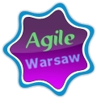
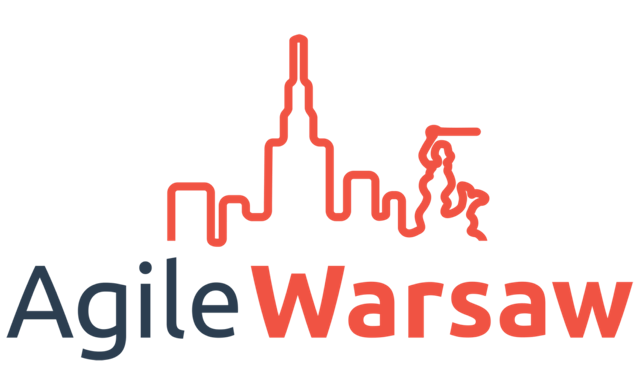

# Histora AgileWarsaw (podziękowanie dla byłych i obecnych animatorów, organizatorów i założycieli)

## Początki (Marek Kirejczyk, Mateusz Srebrny, Paweł Lipiński & Marcin Gozdalik)
Pierwszy pomysł padł na ACE 2010 (wtedy to się nazywało AgileCE ;). Pozazdrościliśmy Krakusom (chyba działało tam wtedy coś innego niż ALE Kraków, ale albo nam się wydawało, albo to jakoś zniknęło, bo teraz to AgileWarsaw jest najstarszą zwinną społecznością w Polsce)

Zgadaliśmy się (w Emerald Irish Pubie przy rondzie de Gaulle'a), że nawet jeśli mielibyśmy spotykać się tylko we czterech, to i tak wystarczająco dużo się będziemy uczyć. Marek wygenerował logo, zarejestrował domenę i postawił *stronę* na google sites.

  

Pierwsze trzy spotkania w maju i czerwcu 2010 (o Kanbanie, spikach i \*DD) zrobili Marek, Mateusz i Paweł, na kolejne dwa udało się namówić Piotrka Sarnackiego i Piotrka Burduło. Potem Marcin o skalowaniu Scruma i można było uznać, że jesteśmy rozkręceni. O speakerów nie zawsze było łatwo, ale kręciło się bez konieczności zapełniania dziur organizatorami.

Spotkania odbywały się na Łuckiej w Aenimie (w firmie Marka), a od stycznia 2013 na Słomińskiego w ElPassion (również dzięki gościnności Marka).

Po kolejnym ACE, Paweł Wrzeszcz i SoftwareMill postanowili zorganizować AgileByExample (z podziwu dla ACE) - zaprosili AgileWarsaw, *bo głupio coś takiego robić w Warszawie bez AgileWarsaw* (ale to inna początek zupełnie innej historii)

W styczniu 2013 trochę zainspirowani i wsparci przez Wiktora Żołnowskiego zaczęliśmy robić BYOPy / Lean Coffee, zwykle w terminach, gdzie nie mieliśmy nagranego speakera.

## Przenosiny na meetup (Marek Kirejczyk, Mateusz Srebrny, Piotr Burdyło)

Po sukcesie dwóch pierwszych AgileByExample w marcu 2013 zrobiliśmy wraz z SoftwareMillem pierwszego AgileByExample lighta - odziedziczyliśmy po nim meetup oraz Piotra Burdyło, który oficjalnie dołączył do Marka i Mateusza jako organizator AW.

W tym momencie mieliśmy 258 osób zapisanych na grupie mejlowej - meetup szybko przyspieszył dynamikę wzrostu rozmiaru grupy (o tym później)

W maju 2013 Marek zlecił ElPassionowskiemu grafikowi profesjonalne logo. 

Robiliśmy też pierwsze próby z nagrywaniem, powstał kanał YT, ale dużo częściej kabelek od ElPassionowskiej kamery był zgubiony, a nawet jak nie był, to filmy lądowały u kogoś na dysku i prawie nigdy nie udawało się znaleźć czasu / mocy na przerobienie ich do formy strawnej dla youtube'a.

W zasadzie cały 2015 rok zszedł na poszukiwanie naszego miejsca. ElPassion zrobiło się za małe, szukaliśmy czegoś bardziej kawiarniowego. Mieliśmy kilka spotkań w Wilsonie na Felińskiego, w Avivie na Domaniewskiej, w Domu Braci Jabłkowskich na Brackiej. Około pół roku eksperymentowaliśmy z MiTo na Waryńskiego. Niestety i tak było za ciasno, więc ostatecznie od listopada 2015 na stałe zdecydowaliśmy się na Avivę na Domaniewskiej - niezbyt blisko, ale za to przestrzennie oraz bardzo gościnnie.

## Era wideo (Łukasz Szóstek, Mateusz Srebrny)

## ciąg dalszy nastąpi :)

Luźne fakty:
* Reef dołączył jako organizator  Feb 22, 2017

Notatki Łukasza wyciągnięte z nagrań:

  * pierwsze video zrobione przez Łukasza: 28.11.2015 — przyjechał Ran Nyman i szkoda było tego jakoś nie utrwalić
  * pierwsze sponsorowane nagranie: ProCognita sponsoruje Mary Poppendieck, którą z resztą nam sprowadzili
  * od listopada 2016 mamy regularnie sponsorowane nagrania
